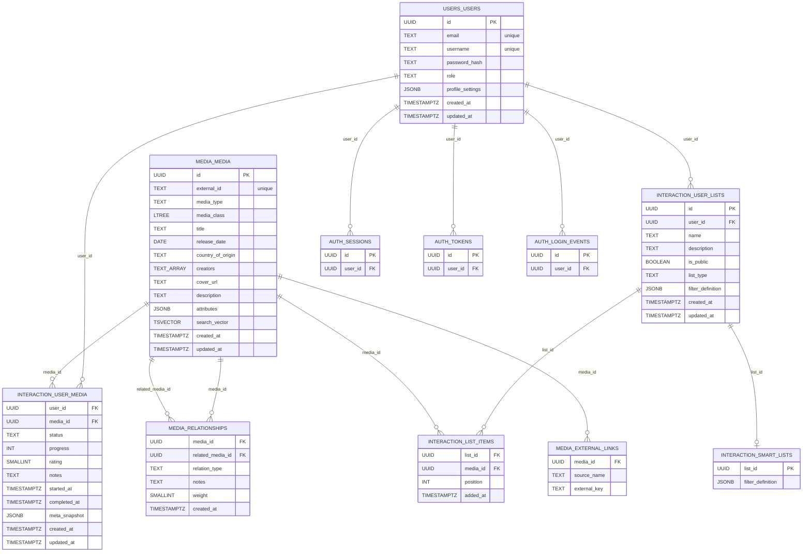

# OmniMediaTrak ER Diagram

```mermaid
erDiagram
  MEDIA_MEDIA {
    UUID id PK
    TEXT external_id "unique"
    TEXT media_type
    LTREE media_class
    TEXT title
    DATE release_date
    TEXT country_of_origin
    TEXT_ARRAY creators
    TEXT cover_url
    TEXT description
    JSONB attributes
    TSVECTOR search_vector
    TIMESTAMPTZ created_at
    TIMESTAMPTZ updated_at
  }

  USERS_USERS {
    UUID id PK
    TEXT email "unique"
    TEXT username "unique"
    TEXT password_hash
    TEXT role
    JSONB profile_settings
    TIMESTAMPTZ created_at
    TIMESTAMPTZ updated_at
  }

  INTERACTION_USER_MEDIA {
    UUID user_id FK
    UUID media_id FK
    TEXT status
    INT progress
    SMALLINT rating
    TEXT notes
    TIMESTAMPTZ started_at
    TIMESTAMPTZ completed_at
    JSONB meta_snapshot
    TIMESTAMPTZ created_at
    TIMESTAMPTZ updated_at
  }

  INTERACTION_USER_LISTS {
    UUID id PK
    UUID user_id FK
    TEXT name
    TEXT description
    BOOLEAN is_public
    TEXT list_type
    JSONB filter_definition
    TIMESTAMPTZ created_at
    TIMESTAMPTZ updated_at
  }

  INTERACTION_LIST_ITEMS {
    UUID list_id FK
    UUID media_id FK
    INT position
    TIMESTAMPTZ added_at
  }

  INTERACTION_SMART_LISTS {
    UUID list_id PK
    JSONB filter_definition
  }

  MEDIA_RELATIONSHIPS {
    UUID media_id FK
    UUID related_media_id FK
    TEXT relation_type
    TEXT notes
    SMALLINT weight
    TIMESTAMPTZ created_at
  }

  MEDIA_EXTERNAL_LINKS {
    UUID media_id FK
    TEXT source_name
    TEXT external_key
  }

  AUTH_SESSIONS {
    UUID id PK
    UUID user_id FK
  }

  AUTH_TOKENS {
    UUID id PK
    UUID user_id FK
  }

  AUTH_LOGIN_EVENTS {
    UUID id PK
    UUID user_id FK
  }

  USERS_USERS ||--o{ INTERACTION_USER_MEDIA : user_id
  MEDIA_MEDIA ||--o{ INTERACTION_USER_MEDIA : media_id

  USERS_USERS ||--o{ INTERACTION_USER_LISTS : user_id
  INTERACTION_USER_LISTS ||--o{ INTERACTION_LIST_ITEMS : list_id
  MEDIA_MEDIA ||--o{ INTERACTION_LIST_ITEMS : media_id

  INTERACTION_USER_LISTS ||--o| INTERACTION_SMART_LISTS : list_id

  MEDIA_MEDIA ||--o{ MEDIA_RELATIONSHIPS : media_id
  MEDIA_MEDIA ||--o{ MEDIA_RELATIONSHIPS : related_media_id

  MEDIA_MEDIA ||--o{ MEDIA_EXTERNAL_LINKS : media_id

  USERS_USERS ||--o{ AUTH_SESSIONS : user_id
  USERS_USERS ||--o{ AUTH_TOKENS : user_id
  USERS_USERS ||--o{ AUTH_LOGIN_EVENTS : user_id
```
