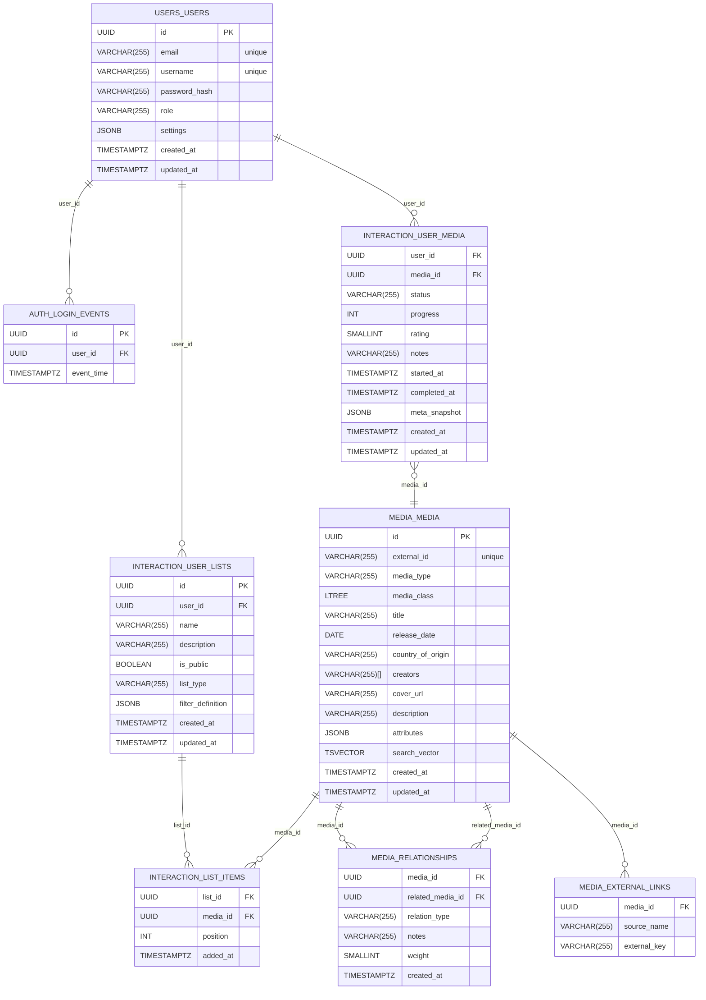

# OmniMediaTrak ER Diagram

## Auth lifecycle note

- Current implementation: sessions/tokens are handled by backend application logic.
- Before scale hardening: move to DB-backed `auth.sessions` and `auth.tokens` (with `auth.login_events`) for durability, revocation, and multi-instance consistency.

## Attributes lifecycle note

- Current implementation: non-universal media attributes are stored in `media.media.attributes` JSONB.
- Before scale hardening: move type-specific attributes into media-specific tables.
